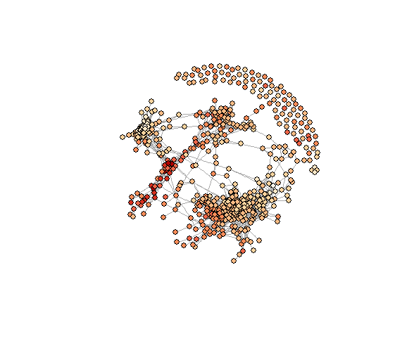

# Weighted correlation network analysis with igraph

D. Levy-Booth 04/08/2016

From Wikipedia: "Weighted correlation network analysis, also known as weighted gene co-expression network analysis (WGCNA), is a widely used data mining method especially for studying biological networks based on pairwise correlations between variables."
https://en.wikipedia.org/wiki/Weighted_correlation_network_analysis 

Only positive correlations are used in this analysis to study
co-occurance and co-abundance. Exclusion is much more difficult to parse with a sparse dataset such as OTU abundance. False-discovery-rate (FDR) correction is used to only plot significant correlations. 

In addition, environmental niches can be explored by mapping factor "preference" as a mean value for each OTU to the network (Robador et al. 2016) http://www.nature.com/ismej/journal/v10/n4/full/ismej2015157a.html

# Analysis Steps: 

1. Optional: Compile OTU, Taxonomy and Sample metadata

2. Optional: Filter OTU data, e.g., removal of low-abundance OTUs

3. Create and filter correlation matrix

4. Create correlation network

5. Optional: Calculate OTU means for environmental factors

6. Apply OTU means as node attributes

7. Plot graphs with OTU variable means as node colors 

8. Optional: Test node coordinant dissimiarity against OTU means

9. Optional: Export network to ploting software (e.g., Cytoscape)

10. Optional: plot OTU variable means against variable distributions in samples 

# Examples: 

